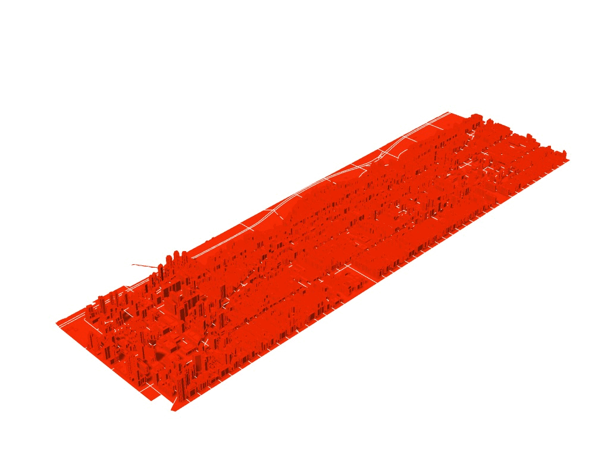
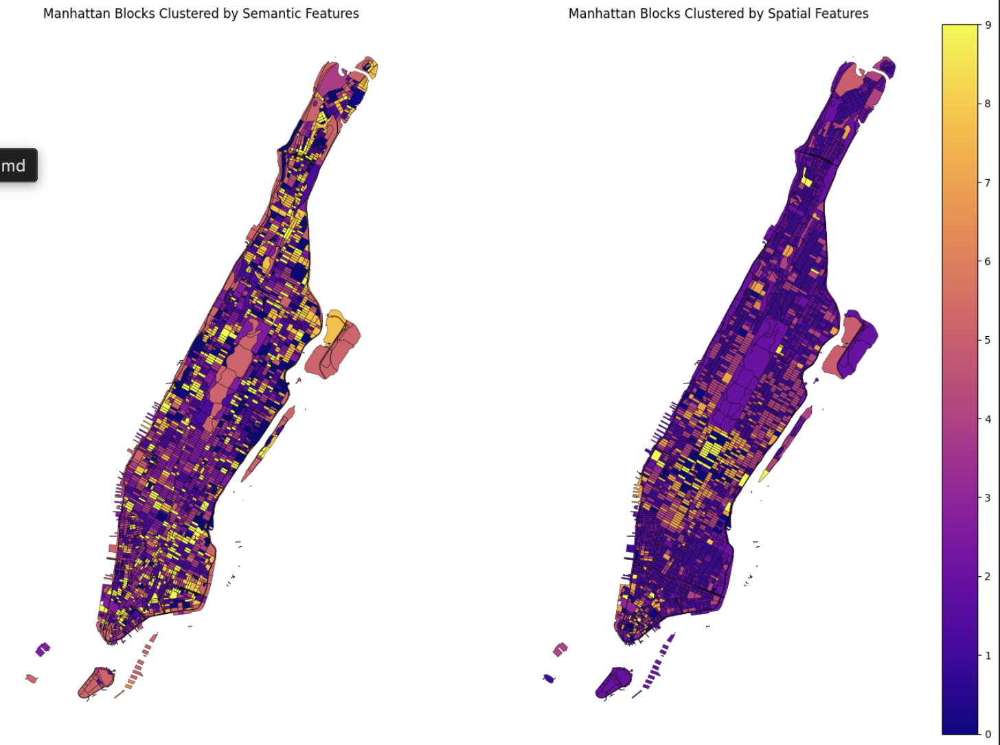

# nyc-semantic-model

## about

this project generates comparative visualizations of the spatial and semantic similarity of blocks in new york city's manhattan borough.

## data

block data is from https://data.cityofnewyork.us/City-Government/2020-Census-Blocks/wmsu-5muw/about_data
(blocks-geodata/...)

building footprints and attributes data is from https://www.nyc.gov/content/planning/pages/resources/datasets/mappluto-pluto-change
(nyc_mappluto/...)

3d model is from https://www.nyc.gov/content/planning/pages/resources/datasets/nyc-3d-model

## methods

### grasshopper

Starting with the UWS neighborhood to reduce computational load, I mapped each building (.3dm) to its block (census data .shp). I then generated per-block spatial attributes, such as density, area, and height. I wrote a custom python script component to run k-means on these features, coloring each building by its cluster.

### python

I used Python, GeoPandas, scikit-learn, and SentenceTransformers to analyze and visualize Manhattan at the block level. Spatial embeddings are created from aggregated building features such as area, number of floors, units, lot area, year built, and commercial area. Semantic embeddings are generated using Google Places data, including counts of place types, top place names, and user reviews, then encoded with a multimodal transformer model. K-means clustering groups blocks by these embeddings, and results are visualized with matplotlib and lonboard as both 2D and interactive 3D maps.

