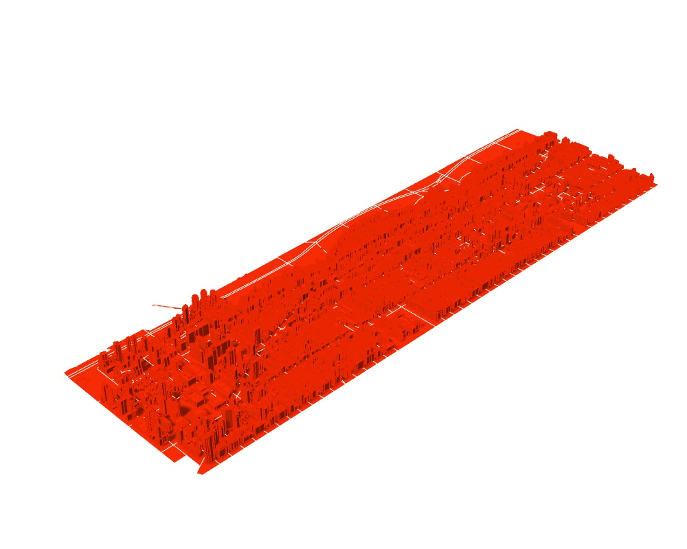
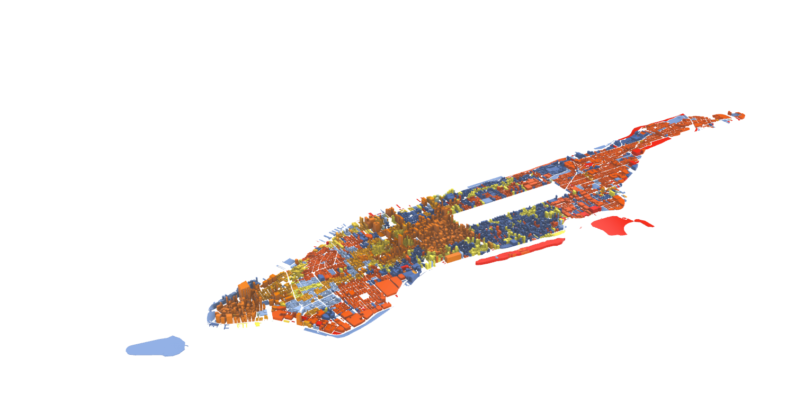
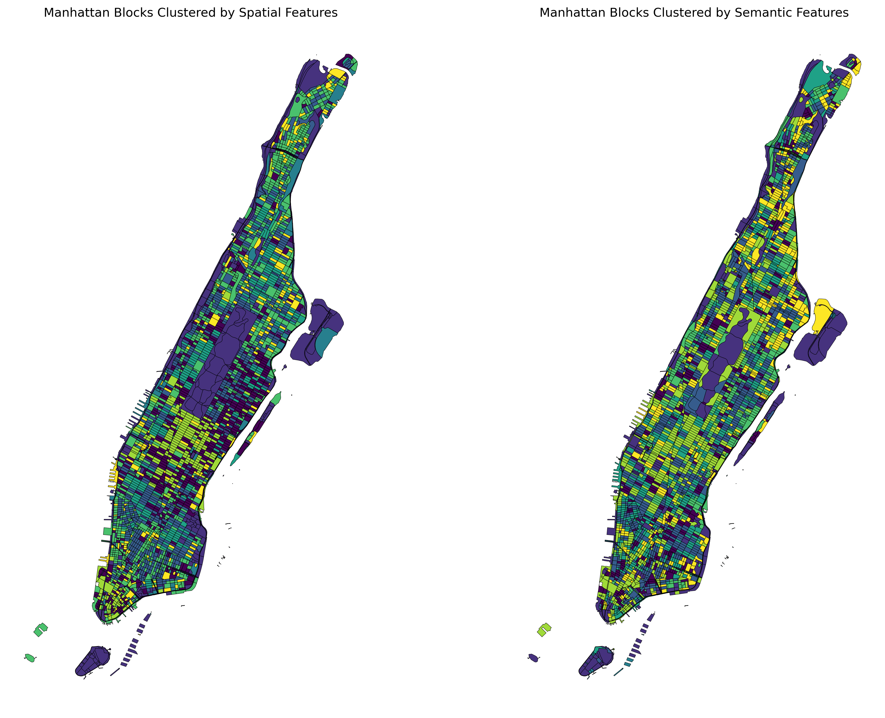

# nyc-semantic-model

## about

this project generates comparative visualizations of the spatial and semantic similarity of blocks in new york city's manhattan borough.

check out the webmap --> https://elliemadsen.github.io/nyc-semantic-model/

## data

block data is from https://data.cityofnewyork.us/City-Government/2020-Census-Blocks/wmsu-5muw/about_data
(`blocks-geodata/...`)

building footprints and attributes data is from https://www.nyc.gov/content/planning/pages/resources/datasets/mappluto-pluto-change
(`nyc_mappluto/...`)

3d model is from https://www.nyc.gov/content/planning/pages/resources/datasets/nyc-3d-model

semantic data is from Google's Places API.

## methods

### grasshopper

To begin, I limited my Grasshopper analysis to the Upper West Side neighborhood to reduce the computational load inflicted by the high cardinality of buildings and blocks. I retrieved building geometries from the NYC Open Data 3dm model and block boundaries from the 2020 Census Data shapefile. After mapping buildings to block, I generated per-block spatial attributes, including density, area, and height. I wrote a custom python script component to run k-means clustering on these features. Buildings are colored by block cluster.

See `model/uws-cluster-blocks.ghx`.

I then expanded my analysis to all of Manhattan. Because the 3d model was too complex to scale, I switched to using MapPLUTO as the data source and simply extruded the building footprints by a factor of floor number. I filtered relevant inputs, including average area (lot, building, etc.), FAR (building, residential, commercial), number of buildings, number of floors, number of units, and year built. I used these attributes to cluster the blocks with k-means and color the buildings accordingly.

See `model/manhattan-cluster-blocks.ghx`.

### python

I used Python libraries `geopandas`, `scikit-learn`, and `SentenceTransformers` to analyze and visualize Manhattan at the block level. Spatial embeddings are created from aggregated building features such as area, number of floors, units, lot area, year built, and commercial area. Semantic embeddings are generated using Google Places data, including counts of place types, top place names, and user reviews, then encoded with a multimodal transformer model. I ran K-means clustering to group the blocks by these embedding features. I used `scipy` to align cluster assignment between the two data sets to maximize overlap. The results are visualized with `matplotlib` and `lonboard`.

I created a network for each cluster by creating edges between each block its 5 nearest neighbors (based on geographic distance) in that cluster. I then exported the data to `webmap-geodata/` in a series of geojson files: buildings, blocks, nodes, semantic network, and spatial network.

See `scripts/gen_places_data.ipynb` and `scripts/map_embeddings.ipynb`.

### javascript

I created an interactive webmap with `Deck.gl` and `MapLibre`. It reads the geojson datasets and creates a simple 3d model by extruding building footprints by number of floors. Buildings, blocks, nodes, and edges are color coded by cluster. Users can toggle between spatial and semantic cluster views, toggle on and off each map layer, adjust layer spacing, and navigate the web map.

See `script.js`.

