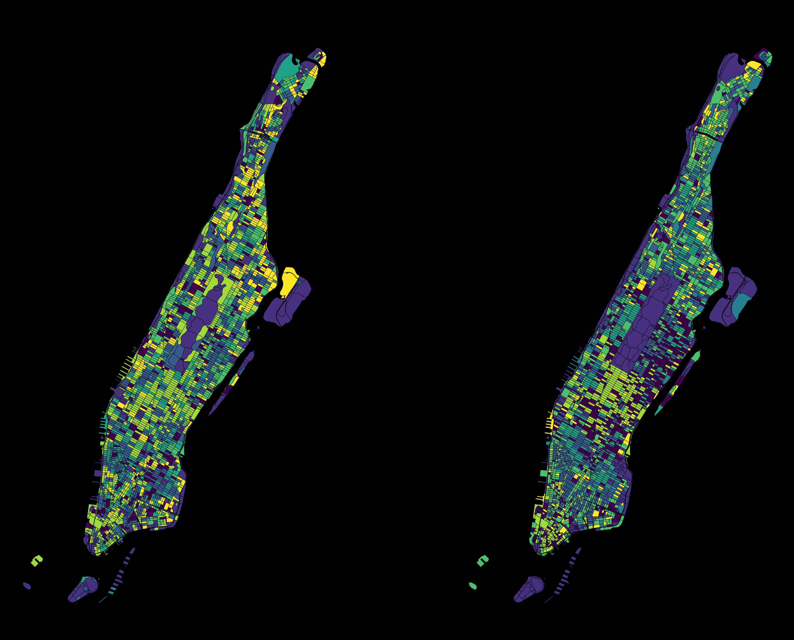

# nyc-semantic-model

## about

this project generates comparative visualizations of the spatial and semantic similarity of blocks in new york city's manhattan borough.

## data

block data is from https://data.cityofnewyork.us/City-Government/2020-Census-Blocks/wmsu-5muw/about_data
(blocks-geodata/...)

building footprints and attributes data is from https://www.nyc.gov/content/planning/pages/resources/datasets/mappluto-pluto-change
(nyc_mappluto/...)

3d model is from https://www.nyc.gov/content/planning/pages/resources/datasets/nyc-3d-model

semantic data is from Google's Places API.

## methods

### grasshopper

Starting with the UWS neighborhood to reduce computational load, I mapped each building (.3dm) to its block (census data .shp). I then generated per-block spatial attributes, such as density, area, and height. I wrote a custom python script component to run k-means on these features, coloring each building by its cluster.

See `model/uws-block-k-means.ghx`.

### python

I used Python libraries `geopandas`, `scikit-learn`, and `SentenceTransformers` to analyze and visualize Manhattan at the block level. Spatial embeddings are created from aggregated building features such as area, number of floors, units, lot area, year built, and commercial area. Semantic embeddings are generated using Google Places data, including counts of place types, top place names, and user reviews, then encoded with a multimodal transformer model. I ran K-means clustering to group the blocks by these embedding features. I used `scipy` to align cluster assignment between the two data sets to maximize overlap. The results are visualized with `matplotlib` and `lonboard`.

I created a network for each cluster by creating edges between each block its 5 nearest neighbors (based on geographic distance) in that cluster. I then exported the data to `webmap-geodata/` in a series of geojson files: buildings, blocks, nodes, semantic network, and spatial network.

See `scripts/`.

### javascript

I created an interactive webmap with `Deck.gl` and `MapLibre`. It reads the geojson datasets and creates a simple 3d model by extruding building footprints by number of floors. Buildings, blocks, nodes, and edges are color coded by cluster. Users can toggle between spatial and semantic cluster views, toggle on and off each map layer, adjust layer spacing, and navigate the web map.

See `script.js`.

